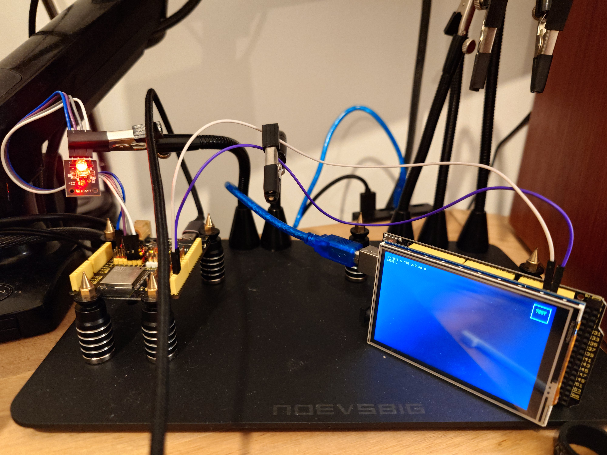

Now that the SerialLink has been tested, it is time to use the reference to link something, like a display!

Requirements:

  ATMEGA2560 with a lLI9486 TFT hat.
  ESP32 with an LED.
  Two wires.

---

---
